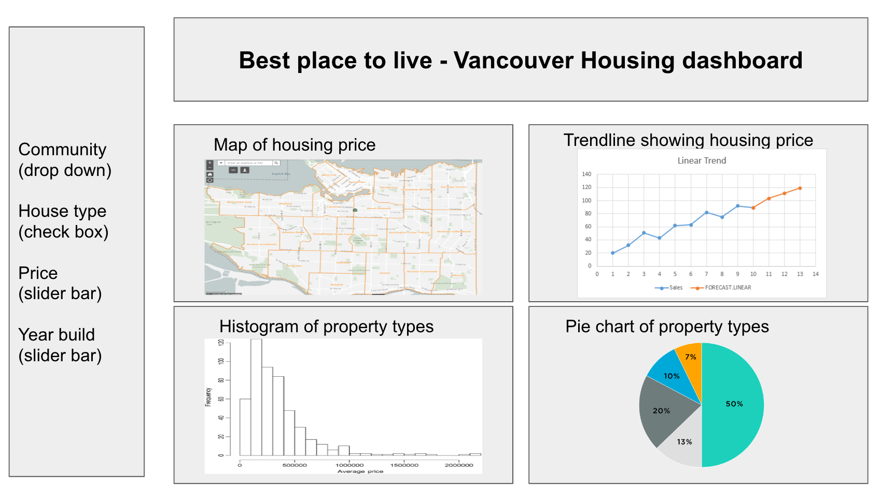

# Best Place to Live - Vancouver Housing Market Dashboard 

A dash for property values in different communities of Vancouver, BC, Canada

-   Authors: HanChen Wang

## Usage

- The app is deployed on render.com [here](best-place-to-live.onrender.com).

## Welcome

Thank you for being interested in my Vancouver Housing Market App!

My app is designed to provide an interactive and informative way to explore the Vancouver housing market. Whether you're a real estate professional, a data analyst, or simply curious about the housing price trends in Vancouver, my app has something for you.

I hope you find my app useful and informative. Happy exploring!

## Motivation and purpose

The housing market in Vancouver has been one of the most active and competitive in North America in recent years, with prices fluctuating dramatically and demand consistently outstripping supply. As a result, real estate professionals, home buyers, sellers, researchers, policymakers, etc. all need access to up-to-date information on housing prices and trends.

The purpose of my app is to provide a user-friendly, interactive, and informative tool for monitoring Vancouver's housing market. The app aggregates data on housing prices from the City of Vancouver Open Data Portal and presents it in an engaging format, allowing users to gain insights into trends and patterns over time.

The motivation for developing this app was to create a comprehensive and informative app that can serve as a valuable resource for anyone interested in understanding Vancouver's housing market. The app is designed to be user-friendly and interactive, with a range of visualizations that help users make sense of the presented information. Ultimately, the goal is to help users stay informed about the state of the market and make better-informed decisions.

More details can be found [here](reports/proposal.md).

## Who are we

I are a team of data scientists at [UBC MDS](https://masterdatascience.ubc.ca) who are passionate about coming up with original, useful solutions to challenges. My team is ideally suited to take on challenging tasks in the field of data analysis because of the wide range of expertise in data science, programming, and statistics that I have.

The development of this app for Vancouver's housing market was a collaborative effort that brought together my team's expertise in data collection, analysis, and visualization.

### Meet the team

-   HanChen Wang

## Description

-   **Map**: An interactive map that allows user to see where the properties are located and hover over the point to see the detailed property values. Based on the area selection all other components will update in real time.
-   **Trendline**: A trendline plot that allows user to see the average property value in different communities of Vancouver, over the past three years. Based on the area selection all other components will update in real time.
-   **Histogram**: Property type distribution plot showing the price range of different properties in Vancouver. Price range and percentage show up when you hover over any bucket in the histogram. Optionally you can also change price range by drag-selecting areas within the current plot.
-   **Pie Chart**: In addition to above histogram, I also included a pie chart showing the percentage of different property types in the communities selected. 

Ideally all the interactive features in these 3 visualizations are linked together. When you make a selection on the left sidebar, all visualizaitons will update accordingly as well.

On the left hand side there are drop down menus, check boxes and slide bars to let you select data points under certain criteria. Currently my design is to let you filter by `community`, `property type`, `price` and `year built`. These filters will apply to all the 3 visualizations on the right.

## Contributing

I welcome anyone who is interested in contributing to my app for Vancouver's housing market. My project is open-source, which means that anyone can view and contribute to the code on my GitHub repository.

If you are interested in getting involved, check out the [contributing guidelines](CONTRIBUTING.md). Please note that this project is released with a [Code of Conduct](CODE_OF_CONDUCT.md). By contributing to this project, you agree to abide by its terms.

## Contact me

If you have any questions, feedback, or suggestions about my Vancouver Housing Market app, I would love to hear from you! You can contact me by visiting my GitHub repository and creating a new issue. This is the best way to reach me if you have technical questions or issues with the app.

Alternatively, you can contact me via email by sending a message to the address listed [here](https://github.com/UBC-MDS/van_houses/blob/main/CONTRIBUTING.md). I welcome any inquiries about the project and are happy to answer any questions you may have.

## Special Thanks

This individual work is based on the group project completed with my team members Morris Zhao, Ken Wang, and Ziyi Chen. The group assignment repo can be found [here](https://github.com/UBC-MDS/van_houses).

## Data Source

The data on housing prices are retrieved from the [City of Vancouver Open Data Portal](https://opendata.vancouver.ca/explore/dataset/property-tax-report/table/?sort=-tax_assessment_year).

## License

Licensed under the terms of the MIT license.
